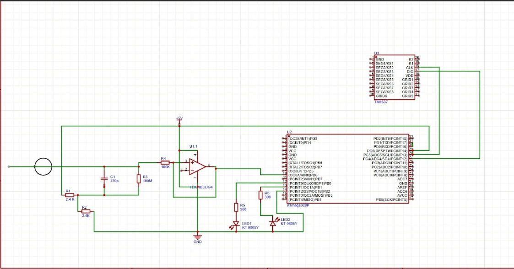

# Ultrasensitive-Electroscope-and-Voltmeter-
The ultrasensitive electroscope is a precision instrument designed to detect extremely small amounts of electric charge and weak electrostatic fields that are undetectable by conventional electroscopes. It operates by converting minute electrical charges into measurable mechanical motion, allowing clear visualization of charge polarty. 

 

 
